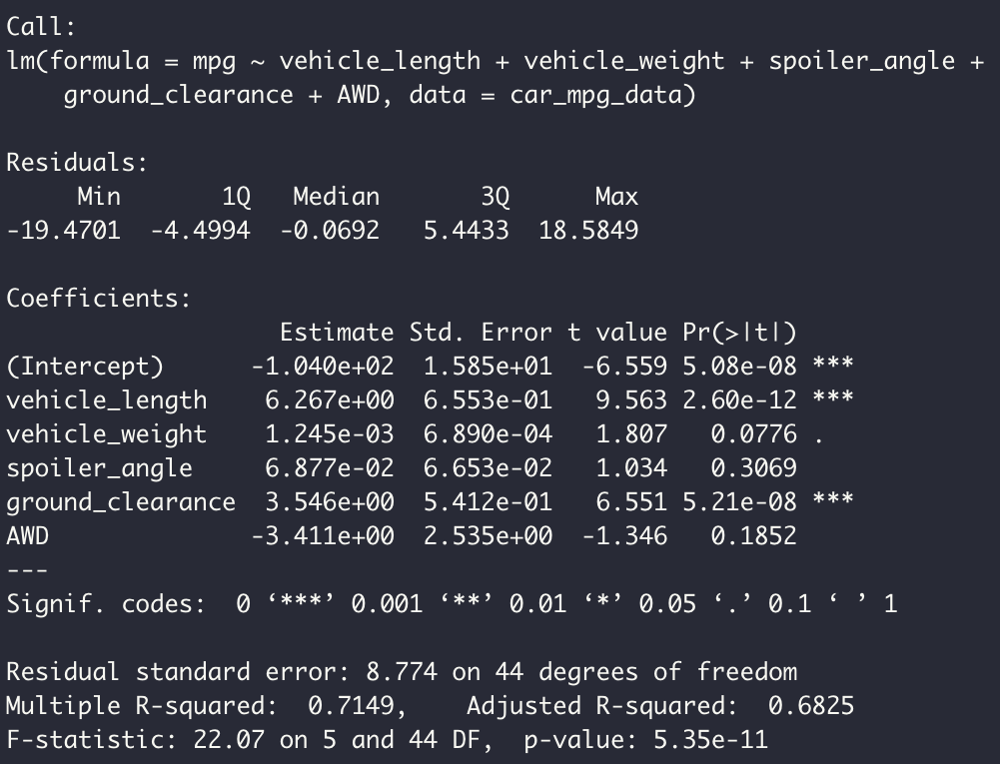
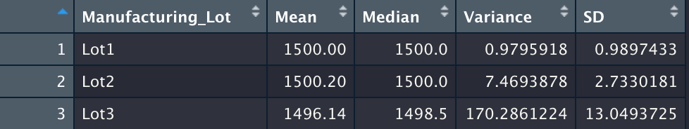
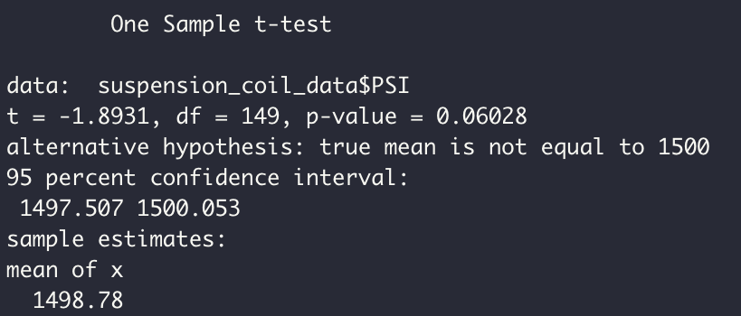
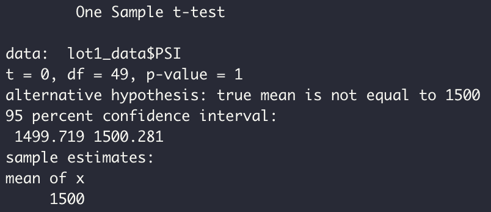
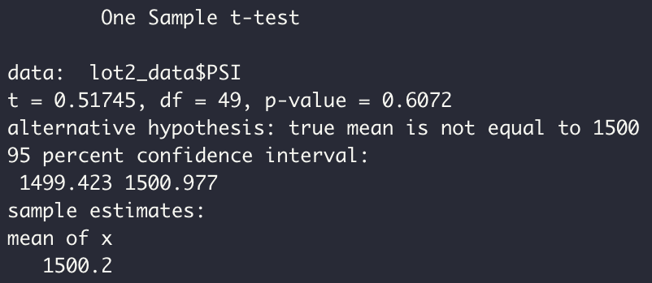
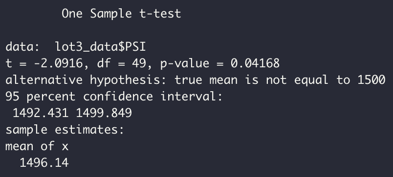

# MechaCar_Statistical_Analysis

## Project Overview
AutosRUs’ newest prototype, the MechaCar, is suffering from production troubles that are blocking the manufacturing team’s progress. AutosRUs’ upper management has called on Jeremy and the data analytics team to review the production data for insights that may help the manufacturing team.

## Resources
Data: MechaCar_mpg.csv, Suspension_Coil.csv

## Results 

### Deliverable 1: Linear Regression to Predict MPG
A multiple linear regression was performed to analyze which

* Which variables/coefficients provided a non-random amount of variance to the mpg values in the dataset?

  The two variables that provided a non-random amount of variance are the ground clearance and vehicle length. These variables p-values were    smaller than the significant value which means that their contribution was not random. 

* Is the slope of the linear model considered to be zero? Why or why not?
  The slope of the linear model is not zero. The linear regression shows that some of the independent variables positively effected the dependent variable. This causes the slope to be greater than zero. 
  
* Does this linear model predict mpg of MechaCar prototypes effectively? Why or why not?
  For predictability, we will analyze the r-squared value. Since the r-squared value is 0.7149, which means out of 100 cases, this model could predict the mpg correctly about 71 times. Therefore, we can consider this module to be effective. 
  
### Deliverable 2: Summary Statistics on Suspension Coils
For this section, I analyzed 2 summary tables to look at the mean, median, variance, and standard deviation. One table looked at all the data as a whole and the other broke down the data into the 3 manufacturing lots. 

* The design specifications for the MechaCar suspension coils dictate that the variance of the suspension coils must not exceed 100 pounds per square inch. Does the current manufacturing data meet this design specification for all manufacturing lots in total and each lot individually? Why or why not?
  Looking at the total summary, the variance is 76.23 PSI. This does meet the design requirements of less than 100. 
  
  When looking at lot summary data, we can see that lots 1 and 2 meet the design requirements, but lot 3 does not. Lot 3 has a variance PSI of 170.29 which is more than 1.5x the PSI desired in the design requirements. 

### Deliverable 3: T-Test on Suspension Coils

Complete Suspension data t-test has a mean of 1498.78 with a p-value of 0.06.

Lot1 data t-test has a mean of 1500 and a p-value of 1. This means Lot1 appears to have no differences from the population mean. 

Lot2 data has a mean of 1500.2 and a p-value of 0.61. This means Lot2 appears to have statistically small difference from the population mean. 

Lot3 data has a mean of 1496.14 and a p-value of 0.04. The p-value is below the significant value of 0.05. This means that the PSI in lot3 statistically differs from the population mean. 

### Deliverable 4: Study Design: MechaCar vs Competition
Perform an analysis on MechaCar compared to a competitor based on overall performance. 

* What metric or metrics are you going to test?
  I would look into referencing data from a source like Consumer Reports.
  
  - Cost
  - Safety Rating
  - Predicted Reliability
  - Road Test Score 
  
* What is the null hypothesis or alternative hypothesis?
  Null Hypothesis: Based on performance metrics, MechaCar will perform the same as the competition. 

  Alternative Hypothesis: Based on performace metrics, MechaCar will perform better than the competition. 

* What statistical test would you use to test the hypothesis? And why?
  I would perform a muliple linear regression and a t-test. This would show which variables correlate with overall performance. 
  
* What data is needed to run the statistical test?
  Data from MechaCar and a competitior for several years for Costs, safety ratings, reliability over time, and a score showing the cars performance on the road. This data is an example found from consumerreports.org. 
